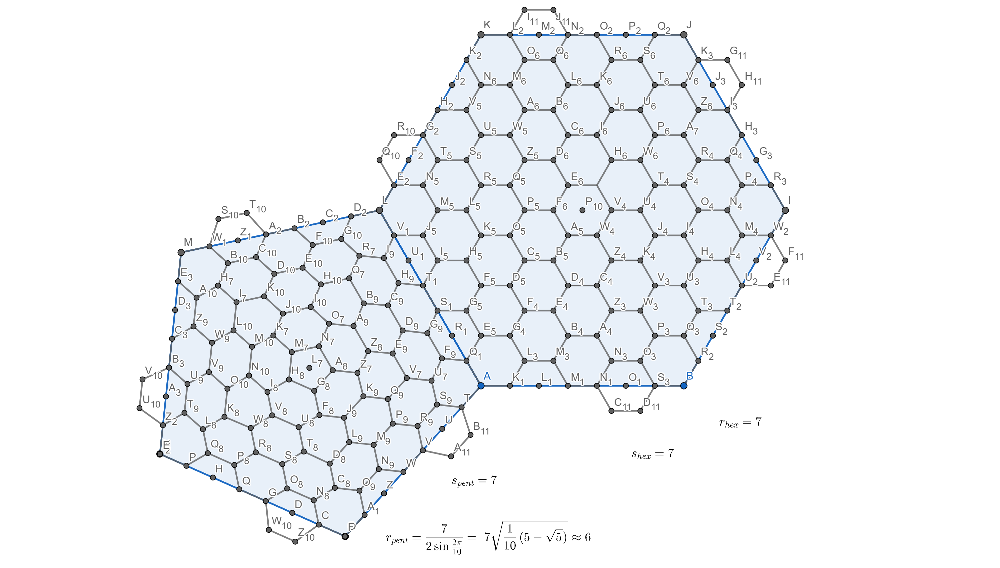

# Some WebGL code I have played around with:
* [Twist a triangle](WebGL/examples/twist0.html) - Warp a triangle with a twist.
 Demonstration of 2D Geometry manipulation on a 3D HTML5 canvas and breaking up
 a shape using fractal geometry to enable warping.
* [3D maze](WebGL/examples/maze1.html) - Navigate through a 3D maze using WASD
 keys. A demonstration of randomized maze generation with parameter inputs,
 keyboard input capture, camera position manipulation, and collision detection.
* [Lies about triangles](2dCanvas/TrollTriangle.html) - A geometric toy inspired
 by a [Numberfile video](https://www.youtube.com/watch?v=Yajonhixy4g) about a
 deceptively constructed flawed proof that all triangles equilateral. A
 demonstration of the 2d HTML5 canvas and a geometry system for visualizing and
 manipulating 2D geometric proofs.

# Found code
Snippets of interesting code I have found around the web
* [JavaScript maze generation oneliner](stupidwebtricks/maze.html) - demonstrates
 randomized 2D **"**maze**"** generation using a very brief bit of Javascript originally authored by [Botond Bal&aacute;zs](https://twitter.com/botond_balazs)

# Hexglobe idea 

